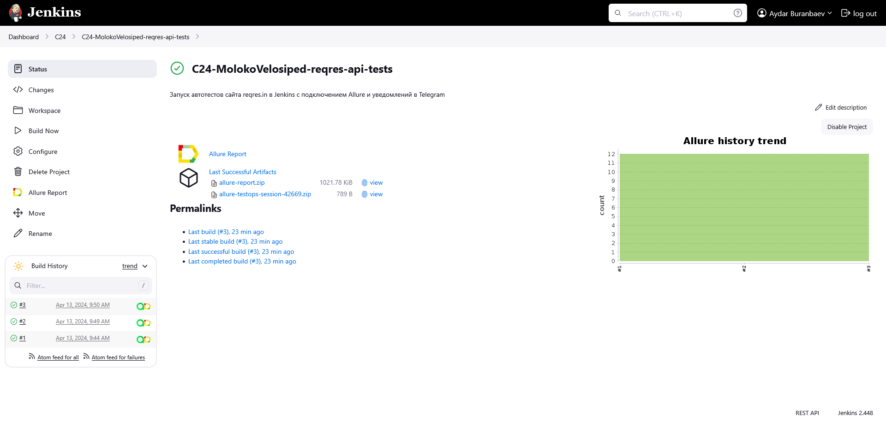
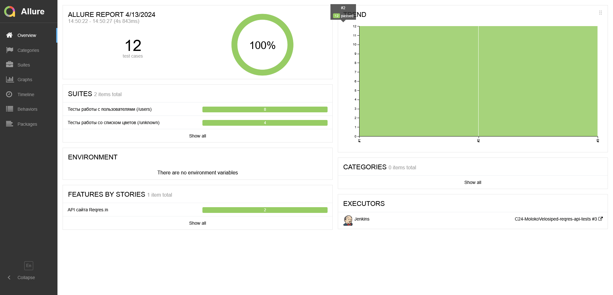
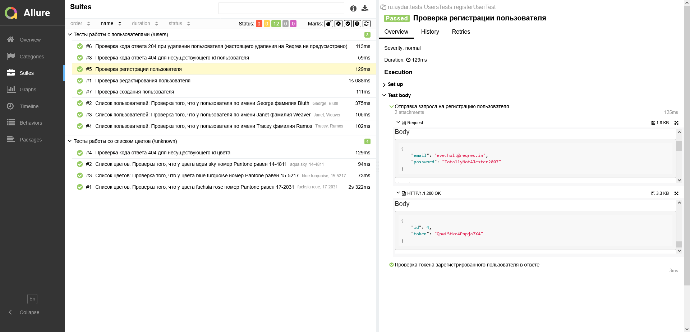
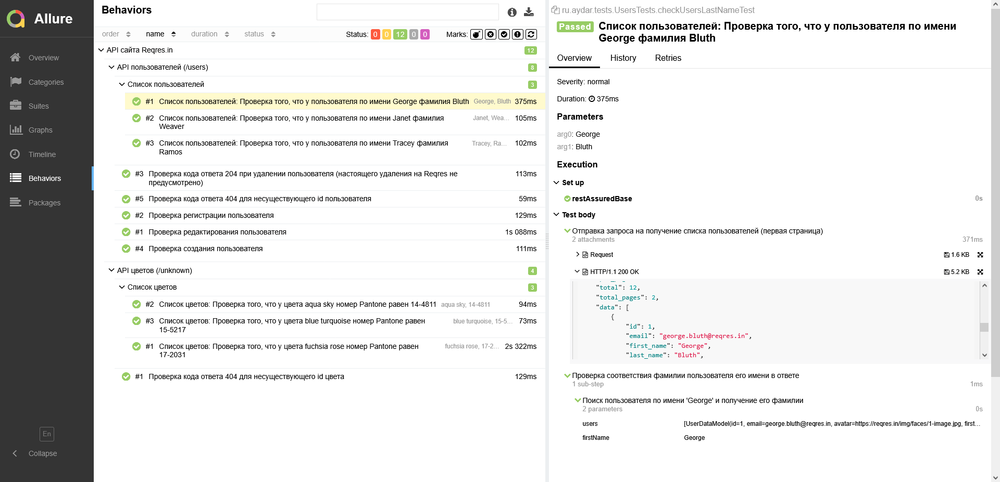
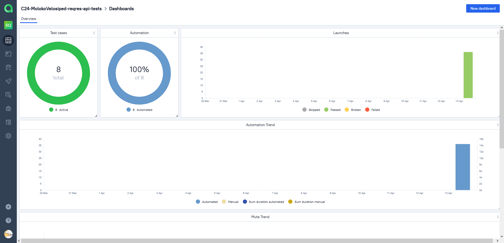
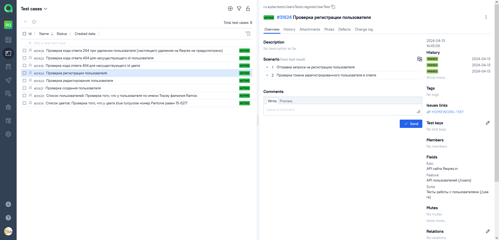
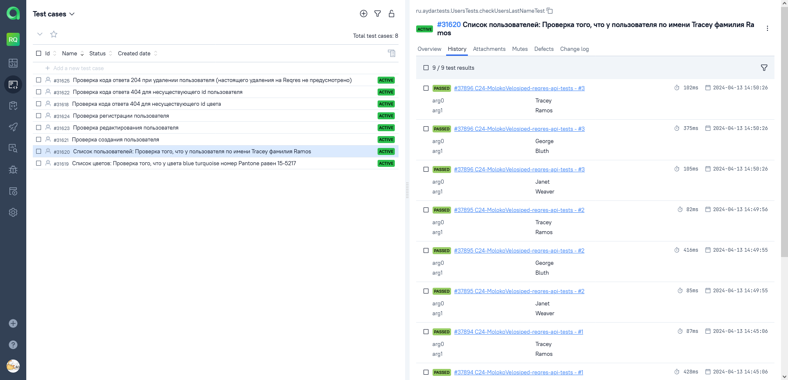
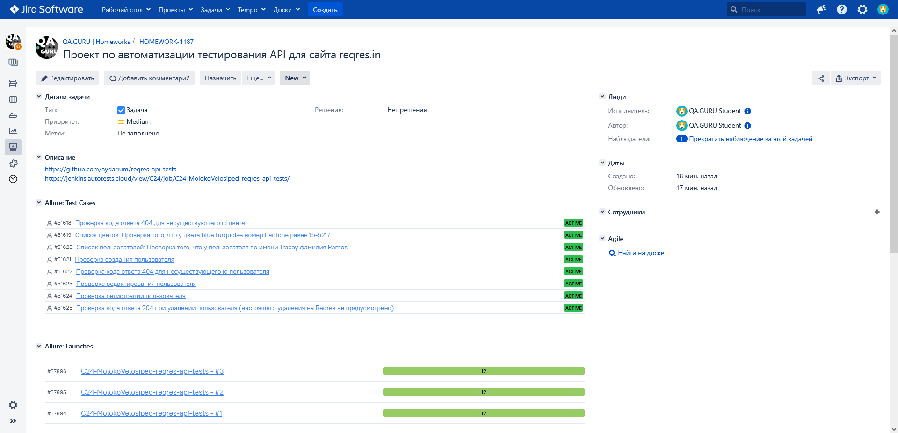
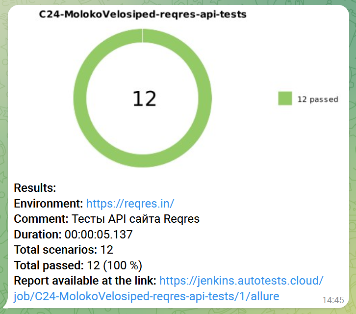

# Проект по автоматизации тестирования API для сайта <a href="https://reqres.in/">reqres.in</a>

<p align="center">
<a href="https://reqres.in/"></a>
</p>

## :scroll: Содержание

- [Используемый стек](#computer-используемый-стек)
- [Покрытый функционал](#male_detective-покрытый-функционал)
- [Локальный запуск тестов](#arrow_forward-локальный-запуск-тестов)
- [Сборка в Jenkins](#-сборка-в-jenkins)
- [Пример Allure-отчёта](#-пример-allure-отчёта)
- [Интеграция с Allure TestOps](#-интеграция-с-allure-testOps)
- [Интеграция с Jira](#-интеграция-с-jira)
- [Уведомления в Telegram с использованием бота](#-уведомления-в-telegram-с-использованием-бота)

## :computer: Используемый стек

<p align="center">
<a href="https://www.jetbrains.com/idea/"></a> 
<a href="https://www.java.com/"></a> 
<a href="https://gradle.org/"></a>
<a href="https://rest-assured.io/"></a> 
<a href="https://github.com/allure-framework/allure2"></a> 
<a href="https://junit.org/junit5/"></a> 
<a href="https://assertj.github.io/doc/"></a> 
<a href="https://github.com/"></a> 
<a href="https://www.jenkins.io/"></a> 
<a href="https://telegram.org/"></a> 
<a href="https://qameta.io/"></a> 
<a href="https://www.atlassian.com/ru/software/jira/"></a> 
</p>

Тесты в проекте написаны на языке <code>Java</code> с использованием [REST Assured](https://rest-assured.io/) и сборщика <code>Gradle</code>. <code>JUnit 5</code> задействован
в качестве фреймворка модульного тестирования.
Для удаленного запуска реализована сборка в <code>Jenkins</code> с формированием Allure-отчёта и отправкой результатов
в <code>Telegram</code> при помощи бота. Также реализована интеграция с <code>Allure TestOps</code> и <code>Jira</code>.

## :male_detective: Покрытый функционал

Reqres – это сайт, предоставляющий публичный доступ к тестовому API, который можно использовать в процессе разработки собственных приложений или как тренажёр по работе с REST API.
<br>Тесты в проекте покрывают следующие фукнции тестового API:
* Получение списка существующих пользователей и данных о них
* Получение списка занесённых в API цветов с описанием их кодов в системе Pantone и шестнадцатитеричном формате
* Получение ответа со статусом 404 при запросе несуществующего пользователя/цвета
* Создание пользователя
* Регистрация пользователя
* Редактирование данных пользователя
* Удаление пользователя (так как тренажёр не изменяет при этом список пользователей, проверяется лишь возвращаемый код 204)

## :arrow_forward: Локальный запуск тестов

```
gradle clean test
```

##  [Сборка](https://jenkins.autotests.cloud/view/C24/job/C24-MolokoVelosiped-reqres-api-tests/) в Jenkins

Для запуска сборки необходимо нажать кнопку <code>Build Now</code>.
<p align="center">

</p>
После выполнения сборки, в блоке <code>Build History</code> напротив номера сборки появятся значки <code>Allure Report</code> и <code>Allure TestOps</code>, при клике на которые откроется страница с сформированным html-отчетом и тестовой документацией соответственно.

##  [Пример](https://jenkins.autotests.cloud/view/C24/job/C24-MolokoVelosiped-reqres-api-tests/3/allure/) Allure-отчёта

<p align="center">

</p>

### Содержание Allure-отчёта

* Тест-кейсы, разделённые на папки по сьютам или фичерам
* Описание шагов тестов
* Запросы, отправленные на API
* Полученные ответы на запросы

### Раздел Suites

<p align="center">

</p>

### Раздел Behaviors

<p align="center">

</p>

##  [Интеграция](https://allure.autotests.cloud/project/4171/dashboards) с Allure TestOps

На *Dashboard* в <code>Allure TestOps</code> видна статистика по тестам, которые приходят по интеграции при каждом запуске сборки вместе с результатами их прохождения.

<p align="center">

</p>

### Тест-кейс, сгенерированный из автотеста

<p align="center">

</p>

### История выполнения автотеста

<p align="center">

</p>

##  [Интеграция](https://jira.autotests.cloud/browse/HOMEWORK-1187) с Jira

Реализована интеграция <code>Allure TestOps</code> с <code>Jira</code>, в тикете отображаются привязанные тест-кейсы и результаты их запусков.

<p align="center">

</p>

##  Уведомления в Telegram с использованием бота

После завершения сборки специальный бот, созданный в <code>Telegram</code>, получает из Jenkins и отправляет сообщение с
отчётом о прогоне тестов.

<p align="center">

</p>
